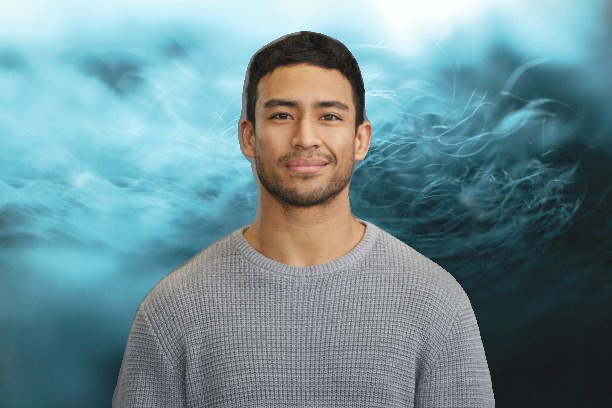

# Background Removal and Replacement using DeepLabv3

## Overview
This project uses the **DeepLabv3** model from PyTorch to perform background removal and replacement. The person is segmented out from the foreground image and replaced with a custom background image.

## Technologies Used
- **Python**: Programming language
- **PyTorch**: Pre-trained DeepLabv3 model
- **OpenCV**: Image processing tasks
- **NumPy**: Array manipulation
- **PIL (Pillow)**: Image handling

## Usage


## 📥 Step 1: Clone the Repository

```bash
git clone https://github.com/yourusername/background-removal.git
cd background-removal
```

## 🧰 Step 2: Install Dependencies

Make sure you have Python installed, then run:

```bash
pip install torch torchvision opencv-python numpy Pillow
```

## 🖼️ Step 3: Prepare Images

Ensure you have the following images in the project folder:

* `foreground.jpg` → The image with the subject (e.g., a person).
* `background.jpg` → The image to use as the new background.

## 🚀 Step 4: Run the Program

Run the script using:

```bash
python virtual-bg.py
```

This will process the images and generate `output.jpg` with the background replaced.



